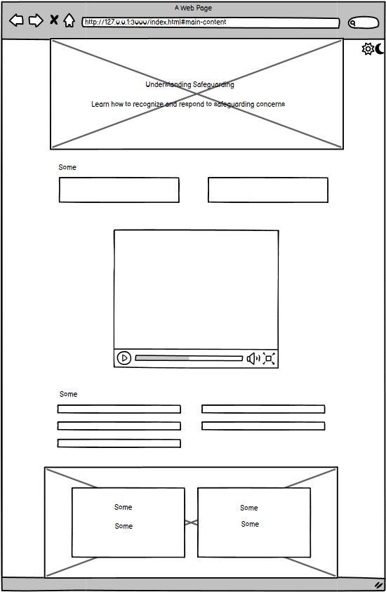
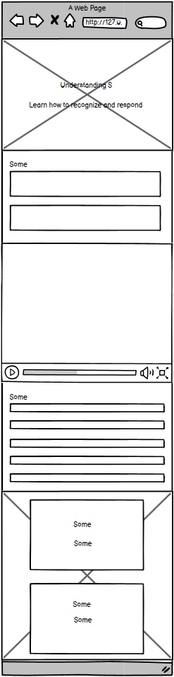

# Safeguarding Practices Guide


## Contents
- [Project Overview](#project-overview)
- [Goals](#goals)
- [User Stories](#user-stories)
- [Wireframe](#wireframe)
- [Project Structure](#project-structure)
- [Pages](#pages)
- [Styles](#styles)
- [Images](#images)
- [Dependencies](#dependencies)
- [Features](#features)
- [AI Usage](#ai-usage)
- [How to Run / Deployment](#how-to-run--deployment)
- [License](#license)
- [Validator Testing](#validator-testing)

## Project Overview
The Safeguarding Practices Guide aims to provide essential information about safeguarding principles and practices. The website helps users understand what safeguarding means, recognize signs of abuse or neglect, and learn how to respond appropriately to concerns. The site uses HTML and CSS with modern accessibility features to create an informative and user-friendly experience.

[Back to Contents](#contents)

## Goals
- **External User's Goal:** To understand safeguarding principles and learn how to recognize and respond to safeguarding concerns effectively.
- **Site Owner's Goal:** To create an accessible and informative resource that promotes understanding of safeguarding practices.

[Back to Contents](#contents)

## User Stories
1) As a professional working with vulnerable people, I want to understand the key principles of safeguarding.
2) As a concerned citizen, I want to learn how to recognize signs of abuse or neglect.
3) As a community worker, I want to know the proper steps to report safeguarding concerns.
4) As an organization leader, I want to understand best practices for implementing safeguarding measures.

[Back to Contents](#contents)

## Wireframe
 

[Back to Contents](#contents)

## Project Structure
```
safeguarding-practices/
├── assets/
│   ├── css/
│   │   └── styles.css
│   ├── js/
│   │   └── theme.js
│   ├── images/
│   │   ├── lonely-lady.webp
│   │   └── ukflag-service.webp
│   └── favicon/
│       └── various favicon files
├── index.html
└── README.md
```
[Back to Contents](#contents)

## Pages
- **index.html:** The main landing page for the Safeguarding Practices Guide website.

[Back to Contents](#contents)

## Styles
- **style.css:** Contains custom CSS styles for the website.

[Back to Contents](#contents)

## Images
- **images/:** Contains website images including hero and footer backgrounds

[Back to Contents](#contents)

## Dependencies
None - The project uses vanilla HTML, CSS, and JavaScript.

[Back to Contents](#contents)

## Features
- Responsive design for all device sizes
- Light/Dark theme toggle
- Accessibility-focused navigation
- Emergency contact information
- Embedded informational video
- Interactive step-by-step guides
- ARIA labels for screen readers

[Back to Contents](#contents)

## AI Usage
I used AI to assist in retagging of common code text, styling and for the generation of the images for hero and footer image. 

[Back to Contents](#contents)

## How to Run / Deployment
1. Clone the repository:
    ```sh
    git clone https://andisperime.github.io/safeguarding-practices/
    ```
2. Open `index.html` in your web browser to view the website.

[Back to Contents](#contents)

## Testing
- Responsive design tested across multiple devices
- WCAG 2.1 accessibility compliance
- Color contrast meets accessibility standards
- Screen reader compatibility verified
- Interactive elements keyboard accessible

[Back to Contents](#contents)

## Validator Testing
1. HTML
   - No errors found using W3C validator
2. CSS
   - No errors found using W3C CSS validator
3. Accessibility
   - WAVE WebAIM accessibility evaluation
   - Lighthouse accessibility score: 100

[Back to Contents](#contents)